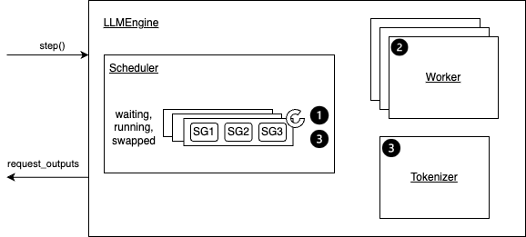
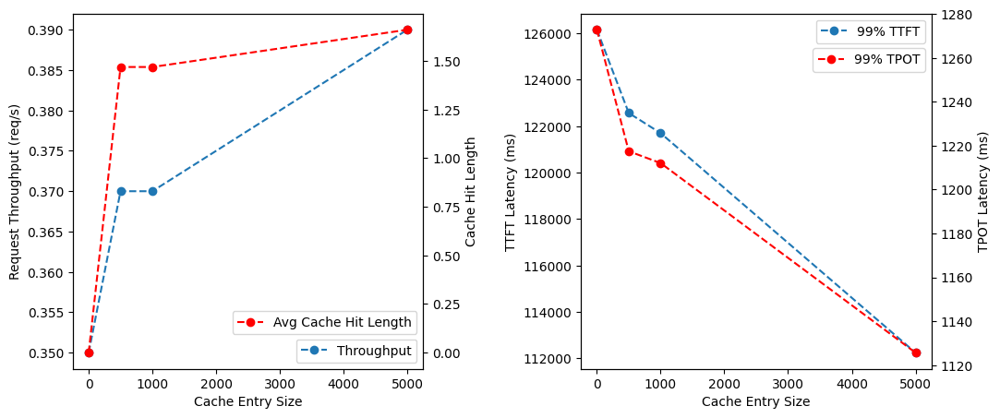
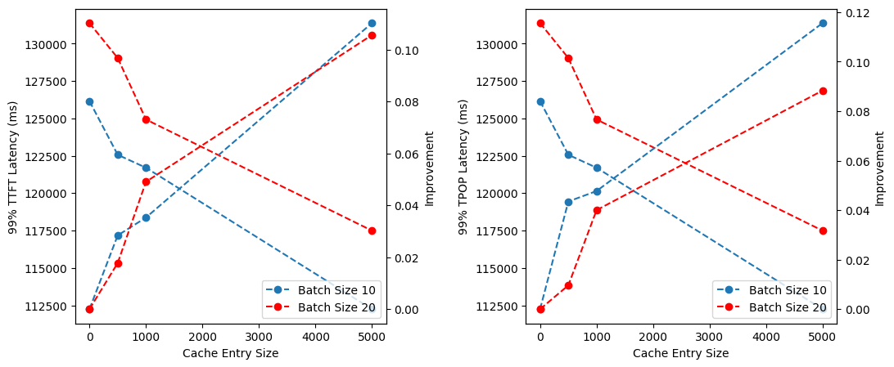

# LLM Inference Mocking

## Overview

Most of this repo is borrowed from the [vLLM](https://github.com/vllm-project/vllm) project for the server architecture described below:



This repo mocks the engine with

- a simple first-come-first-serve scheduler with a fixed batch size
- a mock of the compute time

### Compute Time Mock

Prefills and decodes may be put into a same batch by the scheduler. When this happens, the whole batch is computed as if it is a prefill batch. More specifically, suppose in a batch of size $b$, the i-th sequence being $seq_i$, the length of the i-th sequence being $s_i$, the lenth of the i-th sequence that needs to compute for KV values being $c_i$ (for a decode, it should be 1), the compute complexity is then $O(b\cdot\max_{i}s_i\cdot\max_{i}c_i)$.

The runtime is then mock as the combined time of both compute and memory access as

$$
\frac{b\cdot\max_{i}s_i\cdot\max_{i}c_i}{c_{tflops}\cdot\alpha}+\frac{s_{model}}{m_{bandwidth}}
$$

In the above expression, $\alpha$ is a coefficient to match the compute scale, $s_{model}$ is the model size, and $m_{bandwidth}$ is the GPU memory bandwidth.

In the following experiments, to match the characteristics of A100 GPU, $\alpha=1500$, $c_{tflops}=312$, $s_{model}=$ 120GB, and $m_{bandwidth}=2000$ GB/s. The model size is set to mock the llama-65B model.

### Benchmarking

To benchmark the api server, this repo borrows from the vLLM project except for the following modifications (to remove randomness):

- select requests to send deterministically
- the engine generate the response of a deterministic length (not constant though)

To benchmark, first start the server via `python api_server.py`, then download the [ShareGPT](https://huggingface.co/datasets/anon8231489123/ShareGPT_Vicuna_unfiltered/resolve/main/ShareGPT_V3_unfiltered_cleaned_split.json) dataset and split the first 1K conversations and the 1K-6K conversations to `small-1k.json` and `medium-5k.json`, finally run

```bash
python benchmark_serving.py --dataset small-1k.json --num-prompts 50
```

## Prefix Cache

Although the specs ask for radix tree, I think a trie suits better as a cache for requests. This is because for a incoming request, the cached prefix does not need recomputation, the engine only need to compute the KV values of the remaining sequence. As a result, the cache need to efficiently find the longest matching prefix in the cache. Another consideration is that the actual KV cache are stored on GPUs, the memory overhead of trie from radix tree is minimum.

This repo use a static prefix cache that is built from 5K non-overlapping conversations in the ShareGPT dataset. The building of the cache is as follow:

1. add all prompts into the trie
2. greedily selects the `CACHE_SIZE` most common edges in the trie, and prune other edges

When a new prompt comes, the scheduler queries the cache for the common prefix, note the engine the index to start computing KV values for this sequence.

### Experiment Results



Left: request throughput and matched prefix length with respect to the `CACHE_SIZE`; Right: 99% TTFT and 99% TPOT latency with respect to the `CACHE_SIZE`.

The improvement of the prefix cache is minimum, this is because the matched prefix length is small (~1.5 tokens).The TTFT latency decreases because now the sequence length to be computed decreases by around 1 token. The TPOT latency also decreases because in some batches, decodes are mixed with prefills. This batch has a significantly larger runtime than a pure decode batch. By reducing compute by 1 token, the decode time decreases.

### Effect of Batch Size



Left: the 99% TTFT latency and the improvement of 99% TTFT latency compared with no caching with respect to the `CACHE_SIZE`; Right: the 99% TPOT latency and the improvement of 99% TPOT latency compared with no caching with respect to the `CACHE_SIZE`.

The TTFT and TPOT both decrease with higher batch sizes. This is because for the simple FCFS scheduler, a larger batch means more chances to mix prefills with decodes, which wastes a large amount of computation.
The improvement of the prefix cache is also more significant with lower batch sizes. This may be because with a larger batch size, the TPOT is larger for the no-cache baseline. Although the prefix cache reduces the runtime of mixed batches by 1~2 tokens, this improvement is insignificant compared to the larger baseline.